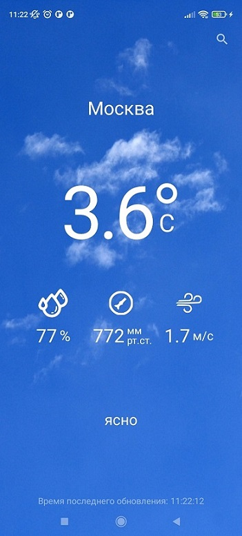

# Weather

#### При разработке приложения использовались следующие технологии:

*Kotlin | MVVM | Clean Architecture | Retrofit2 | Room | Dagger2 | Coroutines* 

Приложение служит для просмотра данных о погоде в выбранном городе.
___
На экране показывается следующая информация:

- Температура воздуха, C
- Влажность, %
- Давление, мм рт.ст.
- Скорость ветра м/с

Для получения погоды требуется нажать на иконку лупы в верхнем правом углу экрана и в открывшемся
поле ввода ввести название нужного города.

Обновление данных реализовано при помощи свайпа сверху вниз.

В нижней части экрана показывается время последнего обновления данных, которые сохраняются в памяти
и показываются при последующем запуске приложения.

Приложение создано на основе API [OpenWeatherMap](https://openweathermap.org/)
